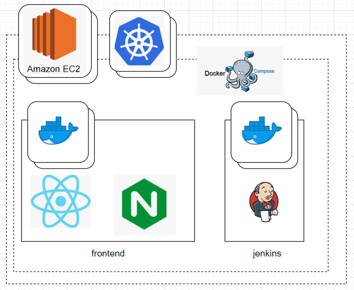

# Portfolio WebSite

## ✈ 개발 정보

> 개발 기간 : 2023.08.16 ~   
> 개발 인원 : 1명  
> 배포 : http://jinseongpf.site

## 📑 목차

1. [프로젝트 기획 배경](#프로젝트-기획-배경)
2. [기술 스택](#기술-스택)
3. [아키텍처](#아키텍처)
4. [기능 엿보기](#기능-엿보기)

## 📌프로젝트 기획 배경

> 나 자신을 알리기 위한 포트폴리오 사이트

백엔드 개발자로써, 프론트엔드와 인프라와 같은 다른 소프트웨어 영역에 대한 깊은 이해와 협업 능력을 갖추고 싶었습니다. 또한, 나만의 스킬셋과 경험을 표현할 수 있는 포트폴리오 사이트의 필요성을 느꼈습니다. 이러한 동기로, 프론트엔드에는 React.js를 사용하여 UI를 구성했으며, 인프라 구축에는 EC2, Docker, Docker-Compose 및 Jenkins를 활용하여 CI/CD를 구현하여 프로젝트가 자동으로 빌드 및 배포될 수 있게 하였습니다.

주요 개발 목적은 아래와 같습니다.

1. **기술적 이해 및 협업 능력 강화**: 다른 소프트웨어 영역에 대한 깊은 이해와 협업 능력을 갖추고 싶었습니다.
2. **개인 포트폴리오 구축의 필요성 인식**: 나만의 스킬셋과 경험을 표현할 수 있는 포트폴리오 사이트의 필요성을 느꼈습니다.
3. **기술 스택 활용과 자동화 구현**: 프론트엔드에는 React.js, 인프라 구축에는 EC2, Docker, Docker-Compose 및 Jenkins를 활용하여 CI/CD를 구현하였습니다.

## 🛠기술 스택

<table>
<tr>
 <td align="center">언어</td>
 <td>
  
 </td>
</tr>
<tr>
 <td align="center">프레임워크</td>
 <td>
	  
</tr>
<tr>
 <td align="center">라이브러리</td>
 <td>

</tr>
<tr>
 <td align="center">패키지 매니저</td>
 <td>
    

  </td>
</tr>
<tr>
 <td align="center">인프라</td>
 <td>
  
  
  
  
  
</tr>
<tr>
 <td align="center">포맷팅</td>
 <td>
   
   
  </td>
</tr>

<tr>
 <td align="center">협업툴</td>
 <td>
    
      
 </td>
</tr>
<tr>
 <td align="center">기타</td>
 <td>
    
     
 </td>
</tr>
</table>

## 🧱아키텍처

